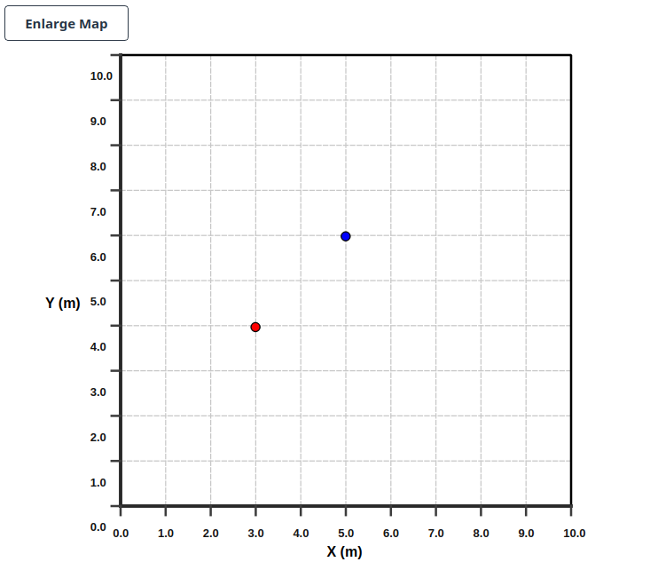
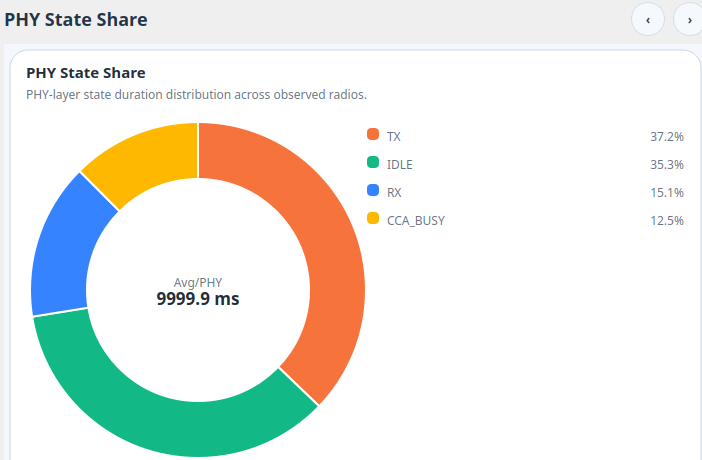

# ns3-Visualizer

**Language:** English | [简体中文](README.zh-CN.md)

`ns3-Visualizer` is an ns-3 contrib module for building, running, and analyzing
Wi-Fi simulations through a Qt-based graphical workflow. It combines scenario
configuration, JSON persistence, script generation, ns-3 execution, shared-memory
trace collection, and interactive PHY/MAC visualization in one tool.

This repository provides the visualizer contrib module and a small scratch
launcher. Users install it into an existing ns-3 source tree.


## Table of Contents

- [Package Layout](#package-layout)
- [Main Capabilities](#main-capabilities)
- [Requirements](#requirements)
- [Installation](#installation)
- [Build](#build)
- [Run Mode 1: Full GUI Mode](#run-mode-1-full-gui-mode)
- [Run Mode 2: One-Command Script Mode](#run-mode-2-one-command-script-mode)
- [UI Guide](#ui-guide)
- [Visualization Guide](#visualization-guide)
- [Project and Data Files](#project-and-data-files)
- [Module Layout](#module-layout)
- [Troubleshooting](#troubleshooting)

## Package Layout

After cloning this repository, the important paths are:

```text
Ns3-based-Visualization/
├── README.md
├── README.zh-CN.md
├── img/
├── tools/
│   └── visualizer.cc
└── contrib/
    └── Ns3Visualizer/
```

During installation, copy `contrib/Ns3Visualizer` into your ns-3 `contrib/`
directory and copy `tools/visualizer.cc` into ns-3 `scratch/`.

## Main Capabilities

- Full graphical configuration of Wi-Fi simulations, including building
  geometry, AP/STA placement, PHY/MAC parameters, mobility, antenna, EDCA/QoS,
  aggregation, RTS/CTS, beacon behavior, and traffic flows.
- JSON-based scenario storage. The GUI writes `General.json`, AP JSON files,
  and STA JSON files before generating the ns-3 script.
- Automatic standalone C++ script generation under ns-3 `scratch/`.
- Full GUI workflow that generates, builds, runs, and visualizes a simulation.
- One-command script workflow for users who already have their own ns-3 script.
- Shared-memory trace transport from ns-3 to the Qt application.
- PPDU-level timeline visualization, channel-state view, PHY-state view, detail
  inspection, throughput charts, delay charts, frame composition, node
  throughput, RX outcome, MCS distribution, PHY-state pie chart, delay CDF
  view, and simulation output viewer.


## Requirements

Tested target environment:

- Linux.
- ns-3.46.
- CMake supported by the ns-3 build system.
- C++23-capable compiler for the ns-3 contrib module.
- C++17-capable compiler for the Qt frontend.
- Qt 6 is preferred. Qt 5.15 may work if available in your environment.
- Boost Interprocess.

Typical Ubuntu packages:

```bash
sudo apt update
sudo apt install -y build-essential cmake ninja-build qt6-base-dev libboost-all-dev
```

If your distribution only provides Qt 5:

```bash
sudo apt install -y qtbase5-dev
```

## Installation

Clone this repository outside ns-3:

```bash
git clone https://github.com/z14212638-eng/Ns3-based-Visualization.git
```

Copy only the contrib module into your ns-3 tree:

```bash
cp -r Ns3-based-Visualization/contrib/Ns3Visualizer /path/to/ns-3.46/contrib/
```

Copy the full-GUI launcher into ns-3 `scratch/`:

```bash
cp Ns3-based-Visualization/tools/visualizer.cc /path/to/ns-3.46/scratch/visualizer.cc
```

This extra copy step is intentional. `./ns3 run visualizer` works because ns-3
automatically treats `scratch/visualizer.cc` as a user script target named
`visualizer`. Without this scratch launcher, supporting the same command would
require changing ns-3's own source tree or build/run rules, for example by
adding a built-in runner target or modifying how `./ns3 run` discovers
non-scratch executables. This project avoids destructive changes to ns-3 and
keeps Ns3Visualizer as a plugin-style contrib module plus an optional scratch
launcher.

The final paths must be:

```text
/path/to/ns-3.46/contrib/Ns3Visualizer
/path/to/ns-3.46/scratch/visualizer.cc
```

## Build

Configure and build ns-3 from the ns-3 root directory:

```bash
cd /path/to/ns-3.46
./ns3 configure
./ns3 build
```

The build should produce:

```text
build/Ns3VisualizerApp
build/ns3-script-generator
```

`Ns3VisualizerApp` is the Qt frontend. `ns3-script-generator` is used by the
GUI to convert JSON scenario files into a standalone ns-3 C++ script.

## Run Mode 1: Full GUI Mode

Full GUI mode is intended for users who want to create or edit a simulation from
the graphical interface.

The standard way to start full GUI mode is through ns-3:

```bash
cd /path/to/ns-3.46
./ns3 run visualizer
```

The `visualizer` launcher is the `scratch/visualizer.cc` file copied during
installation. It is deliberately placed in `scratch/` so ns-3 can build and run
it through the normal user-script mechanism. The launcher only starts
`build/Ns3VisualizerApp` from the ns-3 root; it does not modify ns-3 internals.
If you only need to start the Qt application directly, the fallback command is:

```bash
./build/Ns3VisualizerApp
```

Workflow:

1. Select the ns-3 directory on the welcome page.
2. Open the scenario selection page.
3. Either select a built-in/default scene or enter the configuration dashboard.
4. Configure building, APs, STAs, mobility, PHY/MAC parameters, and traffic
   flows.
5. Click `Generate`.
6. The GUI writes JSON files, runs `build/ns3-script-generator`, creates a
   `scratch/*.cc` script, runs `./ns3 build`, then automatically runs:

```bash
./ns3 run "<generated-target> --enable-visualizer=1 --precise=1 --rough=1"
```

The exact generated target name depends on the project name and timestamp. The
GUI prints the final command in the output window.

Important behavior:

- Full GUI mode disables the script-side auto viewer launch internally and uses
  the already-open GUI result page instead.
- The result page starts its shared-memory reader before the simulation process
  begins.
- If no PPDU records are received, the result page reports that sniffing failed
  or that the selected script did not emit visualizer records.

## Run Mode 2: One-Command Script Mode

One-command mode is intended for users who already have an ns-3 script and want
to launch the timeline viewer directly from `./ns3 run`.

The simplest command form is:

```bash
./ns3 run "<target> --enable-visualizer=1"
```

This form assumes the target script already parses an `enable-visualizer`
command-line argument and passes that value to
`QNs3Helper::MaybeEnableVisualizer(...)`.

Your script must include the Ns3Visualizer helper and enable tracing:

```cpp
#include "ns3/QNs3-helper.h"

using namespace ns3;

// after AP and STA NetDeviceContainers are created
NetDeviceContainer allDevices = QNs3Helper::MergeDevices(apDevices, staDevices);

// precise=true records every PPDU sample. Set precise=false and rough>1 for
// sampled visualization on large simulations.
QNs3Helper::ConfigureVisualizerSampling(/* precise */ true, /* rough */ 1);

Ptr<SniffUtils> sniffer =
    QNs3Helper::MaybeEnableVisualizer(enableVisualizer,
                                      allDevices,
                                      simulationTime,
                                      /* launchViewer */ true);
```

Expose a command-line flag in your script if you want visualization to be
controlled from the terminal:

```cpp
bool enableVisualizer = false;
bool precise = true;
uint32_t rough = 1;

CommandLine cmd(__FILE__);
cmd.AddValue("enable-visualizer", "Enable Ns3Visualizer timeline capture", enableVisualizer);
cmd.AddValue("precise", "Use precise PPDU visualization", precise);
cmd.AddValue("rough", "Sample one PPDU out of rough records when precise=false", rough);
cmd.Parse(argc, argv);
```

Then run a scratch script:

```bash
cd /path/to/ns-3.46
./ns3 run "your-script --enable-visualizer=1 --precise=1 --rough=1"
```

The command-line flag is not strictly required. If your script sets
`enableVisualizer` to `true` by default and still calls
`QNs3Helper::MaybeEnableVisualizer(enableVisualizer, ..., true)`, then this is
also valid:

```cpp
bool enableVisualizer = true;
bool precise = true;
uint32_t rough = 1;

QNs3Helper::ConfigureVisualizerSampling(precise, rough);
Ptr<SniffUtils> sniffer =
    QNs3Helper::MaybeEnableVisualizer(enableVisualizer,
                                      allDevices,
                                      simulationTime,
                                      /* launchViewer */ true);
```

Run it without extra arguments:

```bash
./ns3 run your-script
```

Use the command-line form when you want the same script to run both with and
without visualization. Use the hard-coded/default-enabled form when the script
is dedicated to visualizer experiments.

Run in sampled mode for heavy simulations:

```bash
./ns3 run "your-script --enable-visualizer=1 --precise=0 --rough=10"
```

What happens:

- `QNs3Helper::MaybeEnableVisualizer(..., true)` starts
  `build/Ns3VisualizerApp --timeline-only` automatically.
- The script writes visualizer records to shared memory.
- The timeline-only viewer reads the records and shows the result dashboard.

You can also start the viewer manually if needed:

```bash
./build/Ns3VisualizerApp --timeline-only
./ns3 run "your-script --enable-visualizer=1 --precise=1 --rough=1"
```

## UI Guide

This section describes every major UI page and panel.

### 1. Welcome and NS-3 Path Page


The welcome page asks for the ns-3 root directory. The selected directory is
validated before the user can enter the simulation workflow. The toolbar also
contains an `NS-3 Path` action so the working directory can be changed later.

Use this page to:

- set `/path/to/ns-3.46`,
- verify that the GUI can locate ns-3 files,
- prepare the default scene browser and script generator paths.

### 2. Scenario Library Page


The scenario page provides three entry points:

- `Simple`: built-in simple examples under
  `contrib/Ns3Visualizer/Simulation/Default/Simple`.
- `Complex`: built-in complex examples under
  `contrib/Ns3Visualizer/Simulation/Default/Complex`.
- `Scratch`: readable `*.cc` files under ns-3 `scratch/`.

The page shows a preview image and Markdown description when a default scene
contains `info.md` and an image asset. `Simulation Selected` runs the selected
scene through the visualizer path. `Config Simulation` opens the full
configuration dashboard. `Load from file` loads a saved project JSON.

### 3. Simulation Configuration Dashboard


The configuration dashboard is the central page for creating a new scenario.
It contains global building settings, AP/STA creation controls, node tables, an
interactive layout canvas, validation/update controls, and the final
`Generate` action.

Use this page to:

- set global simulation duration,
- configure the building size and wall model,
- add or delete AP and STA nodes,
- drag nodes on the map and synchronize their coordinates,
- open AP/STA configuration pages,
- right-click/select a node to edit its traffic in the right sidebar,
- write the current configuration into JSON,
- generate, build, run, and switch to visualization.

### 4. Building and Layout Controls


Building controls define the physical simulation environment:

- X/Y/Z range,
- building type,
- exterior wall type,
- simulation time.



The layout map renders AP and STA positions inside the configured building
boundary. Nodes can be moved interactively. The enlarged map view supports
zooming, panning, and synchronized node repositioning.

### 5. AP Configuration Page


The AP page configures access-point-specific parameters. It includes:

- node position and mobility,
- Wi-Fi standard, channel, center frequency, bandwidth, guard interval, PHY
  model, transmit power, receiver sensitivity, CCA sensitivity, and CCA
  threshold,
- SSID and AP MAC behavior,
- beacon interval, beacon rate, and beacon jitter,
- RTS/CTS enable flag and threshold,
- rate-control algorithm and queue type,
- QoS and EDCA access-category settings,
- A-MSDU and A-MPDU aggregation settings,
- antenna settings,
- AP-owned traffic flows.

The page stores values into the AP JSON configuration and returns to the
simulation dashboard after the AP is accepted.

### 6. STA Configuration Page


The STA page mirrors the AP page for station nodes and adds station-specific
association controls:

- active probing,
- maximum missed beacons,
- probe request timeout,
- association retry behavior.

It also supports mobility, PHY/MAC settings, RTS/CTS, rate control, QoS/EDCA,
aggregation, antenna, and STA-owned traffic flows.

### 7. EDCA/QoS Dialog


The EDCA dialog configures per-access-category contention parameters:

- `AC_VO`, `AC_VI`, `AC_BE`, `AC_BK`,
- CWmin,
- CWmax,
- AIFSN,
- TXOP limit.

These values are applied to AP or STA QoS MAC configuration when QoS is enabled.

### 8. Antenna Dialog


The antenna dialog configures antenna model information used by the node
configuration. It supports selecting antenna type and related gain/beamwidth
parameters where applicable.

### 9. Node Traffic Sidebar


The right sidebar contains a node traffic panel while the configuration page is
active. Right-click or select a node in the map to inspect flows owned by that
node. The panel supports:

- adding a flow,
- editing a selected flow,
- deleting a selected flow,
- clearing all flows for the node,
- selecting destinations from known AP/STA targets.

Changes are synchronized into the JSON model when the simulation configuration
is updated.

### 10. Flow Configuration Dialog


The flow dialog supports multiple traffic abstractions:

- `OnOff`: protocol, destination, start/stop time, ToS, data rate, packet size,
  on-time random variable, off-time random variable, and max bytes.
- `CBR`: protocol, destination, start/stop time, ToS, packet size, interval,
  and max packets.
- `Bulk`: protocol, destination, start/stop time, ToS, and max bytes.

Random-variable controls allow constant, uniform, exponential, and other
parameterized distributions where the UI exposes them.

## Visualization Guide


The result dashboard receives records from ns-3 through shared memory and
updates linked views in real time or after simulation completion.

### PPDU Timeline

The PPDU timeline draws each PPDU as a horizontal time-span item. Width
represents duration. Rows can be organized by sender, channel, or node/link
depending on the selected timeline mode. The view supports:

- wheel zooming,
- horizontal navigation,
- time-range selection,
- image export,
- legend display,
- hover tooltips,
- click-to-inspect PPDU details.

### Channel-State Timeline


The channel-state view reconstructs channel occupancy from PPDU start/end
timestamps. It classifies intervals as IDLE, BUSY, or COLLISION. This view is
useful for quickly locating high-contention periods and idle gaps.

### PHY-State Timeline


The PHY-state view displays radio state transitions such as IDLE, TX, RX,
CCA_BUSY, SWITCHING, SLEEP, and OFF. It helps explain why frames are delayed,
blocked, or overlapping with channel access activity.

### PPDU Detail Sidebar


Clicking a PPDU updates the right detail sidebar. The sidebar shows packet
metadata such as time range, sender, receiver, frame type, MCS, channel, SNR,
aggregation information, queueing delay, MAC end-to-end delay, and reception
outcome when those fields are available.

### Throughput Chart


The throughput chart shows temporal throughput samples calculated from
successfully received PPDU data. Values are rendered in Mbps. The chart also
draws an average line to show the overall trend of the current run.

### Delay Charts


The delay panel switches between:

- `Queueing Delay`: time spent waiting before transmission service,
- `MAC End-to-End Delay`: time from MAC queue entry to successful MAC-level
  completion/acknowledgement.

These charts are useful for identifying MAC congestion and contention-induced
service delay.

Each delay chart also provides `CDF View`:

- X-axis: delay in milliseconds.
- Y-axis: cumulative probability from 0 to 1.
- A curve closer to the left indicates lower overall delay.
- A steeper curve indicates more stable delay.

### Frame Mix Chart


The frame mix chart summarizes the proportions of data, control, management,
and other observed frame categories. It is useful for checking protocol
overhead and verifying whether RTS/CTS, ACK, or management behavior appears as
expected.

### Node Throughput Chart


The node throughput chart aggregates throughput contribution by AP/STA MAC
address and displays node-level share. It helps identify unfairness, traffic
concentration, and asymmetric topology effects.

### RX Outcome Chart


The RX outcome chart groups reception results into successful receptions,
collision-related failures, and other decoding failures. It should be read
together with the PPDU and channel-state timelines.

### MCS Distribution Chart


The MCS distribution chart summarizes modulation and coding scheme usage across
observed transmissions. It helps diagnose rate adaptation behavior and channel
quality.

### PHY State Pie Chart



The PHY state pie chart aggregates the duration share of IDLE, TX, RX,
CCA_BUSY, SWITCHING, SLEEP, OFF, and UNKNOWN states. The center label reports
the average observed duration per PHY. Tooltips also show aggregate duration,
per-PHY average duration, and percentage share.

### Output Window


The `Output` button opens a read-only industrial-gray output window. It shows
the `./ns3 build`, `./ns3 run`, generator, stdout, and stderr logs.

## Project and Data Files

Full GUI mode writes project data under:

```text
contrib/Ns3Visualizer/Simulation/Designed/Designed_<timestamp>/
├── GeneralJson/
│   └── General.json
├── ApConfigJson/
│   └── Ap_<id>.json
└── StaConfigJson/
    └── Sta_<id>.json
```

The generated ns-3 C++ script is written to:

```text
scratch/<generated-target>.cc
```

These files are generated automatically by the full GUI workflow. You can keep
them for later inspection or delete them after the experiment.

## Module Layout

```text
contrib/Ns3Visualizer/
├── CMakeLists.txt
├── model/
│   ├── QNs3.*                 # JSON config structures and parsing helpers
│   └── SniffUtils.*           # ns-3 trace collection and shared-memory writer
├── helper/
│   └── QNs3-helper.*          # helper APIs for Wi-Fi config and visualizer launch
├── examples/                  # example ns-3 scripts using the helper
├── test/                      # ns-3 test skeleton
├── Simulation/Default/        # built-in simple and complex GUI scenes
├── doc/                       # ns-3 module documentation
├── utils/doc/                 # additional notes
└── ui/
    ├── main.cpp               # GUI entry point and timeline-only mode
    ├── mainwindow.*           # page navigation and signal wiring
    ├── simu_config.*          # building/layout/generate/build/run workflow
    ├── ap_config.*            # AP parameter UI
    ├── node_config.*          # STA parameter UI
    ├── flow_dialog.*          # traffic flow editor
    ├── node_traffic_panel.*   # right-sidebar node traffic editor
    ├── ppdu_timeline_view.*   # PPDU/channel/PHY timeline renderer
    ├── *_chart.*              # throughput, delay, RX, MCS, and statistics charts
    ├── process_terminal.*     # output viewer
    └── utils/
        └── ns3-script-generator.cc
tools/
└── visualizer.cc              # scratch launcher for `./ns3 run visualizer`
```

## Troubleshooting

### `build/Ns3VisualizerApp` does not exist

Run:

```bash
cd /path/to/ns-3.46
./ns3 configure
./ns3 build
```

Check whether Qt development packages are installed.

### `build/ns3-script-generator` does not exist

The generator is built together with the Qt frontend. Re-run `./ns3 build` and
check the CMake output for Qt or compiler errors.

### Full GUI mode generates a script but no packets appear

Check the output window. Common causes are:

- simulation time is zero,
- no AP or no STA was configured,
- no traffic flow starts during the simulation,
- the generated script failed to build,
- visualizer tracing was not enabled by either `--enable-visualizer=1` or a
  script-side `enableVisualizer = true` default.

### One-command mode runs but no viewer appears

Check that:

- `build/Ns3VisualizerApp` exists,
- the script calls `QNs3Helper::MaybeEnableVisualizer(..., true)`,
- the environment variable `NS3_VISUALIZER_DISABLE_VIEWER` is not set to `1`,
- you are running from the ns-3 root directory.

### Very large simulations are slow

Use sampled visualization:

```bash
./ns3 run "your-script --enable-visualizer=1 --precise=0 --rough=10"
```

Increase `rough` to reduce the number of displayed PPDU samples.

## License

This project follows the ns-3 contrib-module style. See the source files and
the ns-3 license terms for details.
