# ns3-Visualizer

**语言:** [English](README.md) | 简体中文

`ns3-Visualizer` 是一个 ns-3 contrib 模块，用 Qt 图形界面把 Wi-Fi 仿真的配置、运行和分析整合到同一套工作流中。它支持图形化创建场景、保存 JSON 配置、生成 ns-3 C++ 脚本、执行 `./ns3 build` 和 `./ns3 run`，并通过共享内存把 PPDU/MAC/PHY 级别的记录传给可视化界面。

本仓库只包含 `contrib/Ns3Visualizer` 工具本身，不包含完整 ns-3 源码。


## 目录

- [仓库范围](#仓库范围)
- [主要能力](#主要能力)
- [环境要求](#环境要求)
- [安装](#安装)
- [构建](#构建)
- [运行模式一：全量 GUI 模式](#运行模式一全量-gui-模式)
- [运行模式二：一键脚本模式](#运行模式二一键脚本模式)
- [UI 页面说明](#ui-页面说明)
- [结果可视化说明](#结果可视化说明)
- [项目和数据文件](#项目和数据文件)
- [模块目录说明](#模块目录说明)
- [图片和 GIF 清单](#图片和-gif-清单)
- [常见问题](#常见问题)
- [对开发者的建议](#对开发者的建议)

## 仓库范围

安装后的目标路径应该是：

```text
ns-3.46/
└── contrib/
    └── Ns3Visualizer/
```

GitHub 仓库结构应该保持为：

```text
.
├── README.md
├── README.zh-CN.md
├── img/
├── tools/
│   └── visualizer.cc
└── contrib/
    └── Ns3Visualizer/
```

本仓库不应该包含：

- 完整 ns-3 源码；
- `scratch/` 下的生成脚本；
- `Simulation/Designed/` 下的运行生成项目；
- 本地 `.codex` 配置；
- `AppDir/`、`squashfs-root/`、AppImage 等打包产物；
- `contrib/nr` 等无关 contrib 模块。

## 主要能力

- 图形化配置 Wi-Fi 仿真，包括建筑尺寸、AP/STA 节点、移动模型、PHY/MAC 参数、EDCA/QoS、天线、聚合、RTS/CTS、Beacon 和业务流。
- 使用 JSON 保存场景配置，包括 `General.json`、AP JSON 和 STA JSON。
- 根据 JSON 自动生成可独立运行的 ns-3 C++ 脚本。
- 全量 GUI 模式支持从配置到生成、构建、运行、结果展示的完整流程。
- 一键脚本模式支持用户直接用 `./ns3 run` 启动已有脚本和时间线可视化。
- 使用共享内存在 ns-3 进程和 Qt 前端之间传输记录。
- 提供 PPDU 时间线、信道状态时间线、PHY 状态时间线、PPDU 详情、吞吐量、时延、帧组成、节点吞吐、接收结果和 MCS 分布等视图。


## 环境要求

推荐环境：

- Linux；
- ns-3.46；
- ns-3 构建系统支持的 CMake；
- 支持 C++23 的编译器，用于 ns-3 contrib 模块；
- 支持 C++17 的编译器，用于 Qt 前端；
- 推荐 Qt 6，Qt 5.15 在部分环境下也可以使用；
- Boost Interprocess。

Ubuntu 常用依赖：

```bash
sudo apt update
sudo apt install -y build-essential cmake ninja-build qt6-base-dev libboost-all-dev
```

如果系统只提供 Qt 5：

```bash
sudo apt install -y qtbase5-dev
```

## 安装

先在 ns-3 目录外克隆本仓库：

```bash
git clone https://github.com/z14212638-eng/Ns3-based-Visualization.git
```

只复制 contrib 模块到 ns-3：

```bash
cp -r Ns3-based-Visualization/contrib/Ns3Visualizer /path/to/ns-3.46/contrib/
```

把全量 GUI 启动器复制到 ns-3 的 `scratch/`：

```bash
cp Ns3-based-Visualization/tools/visualizer.cc /path/to/ns-3.46/scratch/visualizer.cc
```

这一步是有意设计的。`./ns3 run visualizer` 能工作，是因为 ns-3 会自动把
`scratch/visualizer.cc` 当作名为 `visualizer` 的用户脚本 target。如果不使用
scratch 启动器，却仍然想支持同样的命令，就需要修改 ns-3 自身源码或构建/运行规则，例如增加内置 runner target，或者修改 `./ns3 run` 发现非 scratch 可执行文件的方式。本项目的原则是不对 ns-3 源码做破坏性修改，而是提供插件式 contrib 可视化模块，再配合一个可选的 scratch 启动器。

最终路径必须是：

```text
/path/to/ns-3.46/contrib/Ns3Visualizer
/path/to/ns-3.46/scratch/visualizer.cc
```

## 构建

在 ns-3 根目录执行：

```bash
cd /path/to/ns-3.46
./ns3 configure
./ns3 build
```

构建成功后应该存在：

```text
build/Ns3VisualizerApp
build/ns3-script-generator
```

`Ns3VisualizerApp` 是 Qt 前端程序。`ns3-script-generator` 用于把 GUI 产生的 JSON 配置转换成 ns-3 C++ 脚本。

## 运行模式一：全量 GUI 模式

全量 GUI 模式适合从界面创建、配置、运行和分析仿真。

全量 GUI 模式的标准启动方式是通过 ns-3 启动：

```bash
cd /path/to/ns-3.46
./ns3 run visualizer
```

这里的 `visualizer` 对应安装时复制到 `scratch/visualizer.cc` 的启动器。它被放在 `scratch/` 中，是为了复用 ns-3 标准用户脚本机制来构建和运行，不需要修改 ns-3 内部代码。这个启动器只负责从 ns-3 根目录启动 `build/Ns3VisualizerApp`。如果只是想直接启动 Qt 程序，也可以使用备用命令：

```bash
./build/Ns3VisualizerApp
```

流程：

1. 在欢迎页选择 ns-3 根目录。
2. 进入场景选择页。
3. 可以选择内置场景，也可以进入配置页面创建新场景。
4. 配置建筑、AP、STA、移动模型、PHY/MAC 参数和业务流。
5. 点击 `Generate`。
6. GUI 会写入 JSON，调用 `build/ns3-script-generator`，在 `scratch/` 下生成 C++ 脚本，执行 `./ns3 build`，构建成功后自动运行：

```bash
./ns3 run "<generated-target> --enable-visualizer=1 --precise=1 --rough=1"
```

实际 target 名称由项目名和时间戳决定，最终命令会显示在 Output 窗口中。

需要注意：

- 全量 GUI 模式内部会禁止脚本侧再次自动拉起新 viewer，因为当前 GUI 已经准备好结果页。
- 结果页会在仿真进程启动前先启动共享内存读取线程。
- 如果没有收到 PPDU 记录，界面会提示 sniff 失败或脚本没有输出可视化记录。


## 运行模式二：一键脚本模式

一键脚本模式适合已经有 ns-3 脚本、只想通过一条 `./ns3 run` 命令启动仿真和可视化的用户。

最简单的命令形式是：

```bash
./ns3 run "<target> --enable-visualizer=1"
```

这种写法要求目标脚本已经解析 `enable-visualizer` 命令行参数，并把该值传给 `QNs3Helper::MaybeEnableVisualizer(...)`。

脚本需要包含 helper 并启用可视化记录：

```cpp
#include "ns3/QNs3-helper.h"

using namespace ns3;

// AP 和 STA 的 NetDeviceContainer 创建之后
NetDeviceContainer allDevices = QNs3Helper::MergeDevices(apDevices, staDevices);

// precise=true 表示记录全部 PPDU；大型仿真可以设置 precise=false 并调大 rough。
QNs3Helper::ConfigureVisualizerSampling(/* precise */ true, /* rough */ 1);

Ptr<SniffUtils> sniffer =
    QNs3Helper::MaybeEnableVisualizer(enableVisualizer,
                                      allDevices,
                                      simulationTime,
                                      /* launchViewer */ true);
```

如果希望从终端控制是否启用可视化，建议在脚本中暴露命令行参数：

```cpp
bool enableVisualizer = false;
bool precise = true;
uint32_t rough = 1;

CommandLine cmd(__FILE__);
cmd.AddValue("enable-visualizer", "Enable Ns3Visualizer timeline capture", enableVisualizer);
cmd.AddValue("precise", "Use precise PPDU visualization", precise);
cmd.AddValue("rough", "Sample one PPDU out of rough records when precise=false", rough);
cmd.Parse(argc, argv);
```

然后运行 scratch 脚本：

```bash
cd /path/to/ns-3.46
./ns3 run "your-script --enable-visualizer=1 --precise=1 --rough=1"
```

命令行参数并不是严格必要的。如果你的脚本里默认设置
`enableVisualizer = true`，并且仍然调用
`QNs3Helper::MaybeEnableVisualizer(enableVisualizer, ..., true)`，那么也可以直接运行：

```cpp
bool enableVisualizer = true;
bool precise = true;
uint32_t rough = 1;

QNs3Helper::ConfigureVisualizerSampling(precise, rough);
Ptr<SniffUtils> sniffer =
    QNs3Helper::MaybeEnableVisualizer(enableVisualizer,
                                      allDevices,
                                      simulationTime,
                                      /* launchViewer */ true);
```

此时命令可以简化为：

```bash
./ns3 run your-script
```

如果同一个脚本既需要普通运行，也需要可视化运行，推荐使用命令行参数。如果这个脚本就是专门用于可视化实验，直接在脚本里默认启用也可以。

大型仿真可以用采样模式：

```bash
./ns3 run "your-script --enable-visualizer=1 --precise=0 --rough=10"
```

执行后：

- `QNs3Helper::MaybeEnableVisualizer(..., true)` 会自动启动 `build/Ns3VisualizerApp --timeline-only`；
- ns-3 脚本把可视化记录写入共享内存；
- timeline-only 窗口读取记录并展示结果仪表盘。

如果需要，也可以手动先启动 viewer：

```bash
./build/Ns3VisualizerApp --timeline-only
./ns3 run "your-script --enable-visualizer=1 --precise=1 --rough=1"
```

## UI 页面说明

这一节说明每一个主要界面和面板。图片文件名已经固定，后续只需要把对应截图或 GIF 放到 `img/` 目录。

### 1. 欢迎页和 NS-3 路径

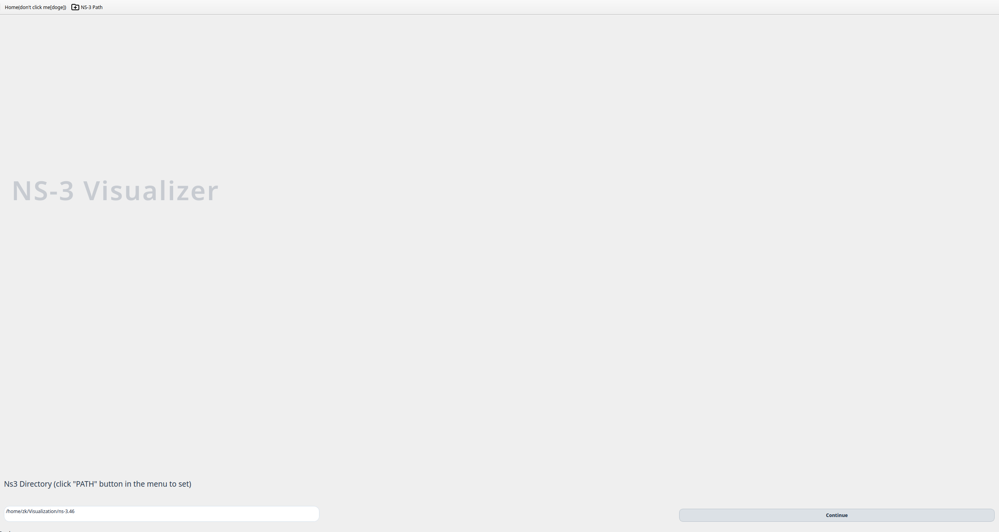

欢迎页用于选择 ns-3 根目录。进入主流程前，程序会检查目录是否有效。顶部工具栏也提供 `NS-3 Path` 入口，用于后续重新选择工作目录。

该页面用于：

- 设置 `/path/to/ns-3.46`；
- 确保 GUI 能找到 ns-3；
- 为默认场景浏览和脚本生成器准备路径。

### 2. 场景库页面


场景页提供三个入口：

- `Simple`：来自 `contrib/Ns3Visualizer/Simulation/Default/Simple` 的简单默认场景；
- `Complex`：来自 `contrib/Ns3Visualizer/Simulation/Default/Complex` 的复杂默认场景；
- `Scratch`：ns-3 `scratch/` 下可读的 `*.cc` 文件。

默认场景如果包含 `info.md` 和预览图，界面会显示说明和图片。`Simulation Selected` 会直接运行选中的场景。`Config Simulation` 进入完整配置流程。`Load from file` 用于加载保存过的项目文件。

### 3. 仿真配置总览页


仿真配置页是创建新场景的核心页面，包括全局建筑参数、AP/STA 创建控制、节点表格、交互式布局图、检查/更新按钮和最终 `Generate` 按钮。

该页面用于：

- 设置仿真时间；
- 设置建筑大小和墙体模型；
- 添加或删除 AP/STA；
- 在地图中拖动节点并同步坐标；
- 进入 AP/STA 配置页；
- 选择节点后在右侧栏编辑该节点的业务流；
- 将当前配置写入 JSON；
- 生成脚本、构建、运行并进入结果界面。

### 4. Building 和布局图

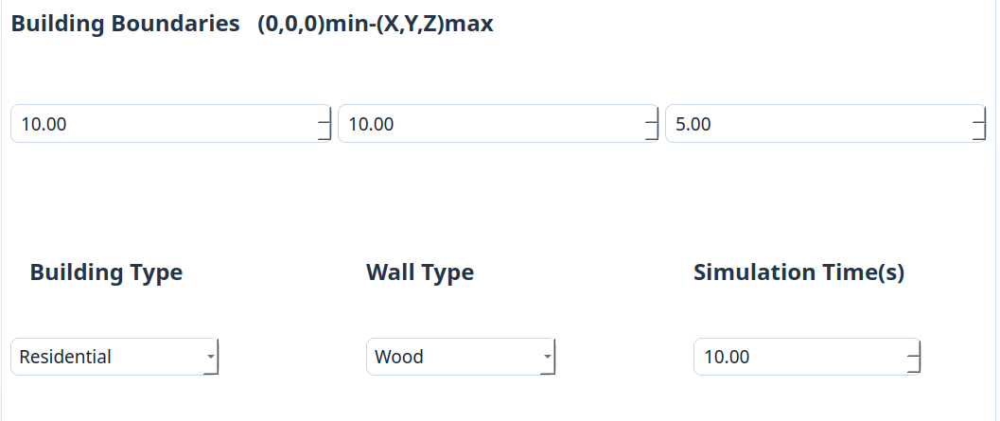

Building 区域定义物理环境：

- X/Y/Z 范围；
- building type；
- exterior wall type；
- simulation time。


布局图显示 AP 和 STA 在建筑范围内的位置。节点可以拖动，放大地图支持缩放、平移和同步更新节点位置。

### 5. AP 配置页

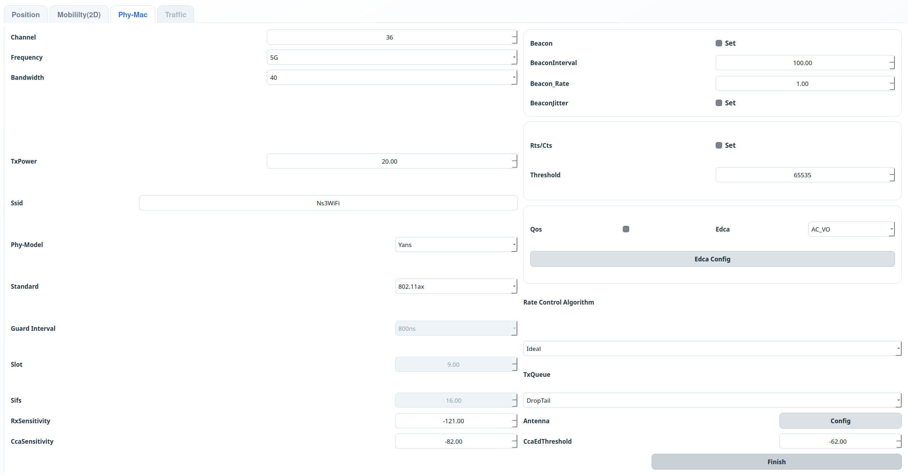

AP 页面用于配置接入点参数，包括：

- 节点位置和移动模型；
- Wi-Fi standard、channel、frequency、bandwidth、GI、PHY model、Tx power、Rx sensitivity、CCA sensitivity、CCA threshold；
- SSID 和 AP MAC 行为；
- Beacon interval、beacon rate、beacon jitter；
- RTS/CTS 开关和阈值；
- 速率控制算法和队列类型；
- QoS 和 EDCA；
- A-MSDU 和 A-MPDU 聚合；
- 天线参数；
- AP 发起的业务流。

确认后，AP 参数会写入 AP JSON 配置，并返回仿真配置页。

### 6. STA 配置页

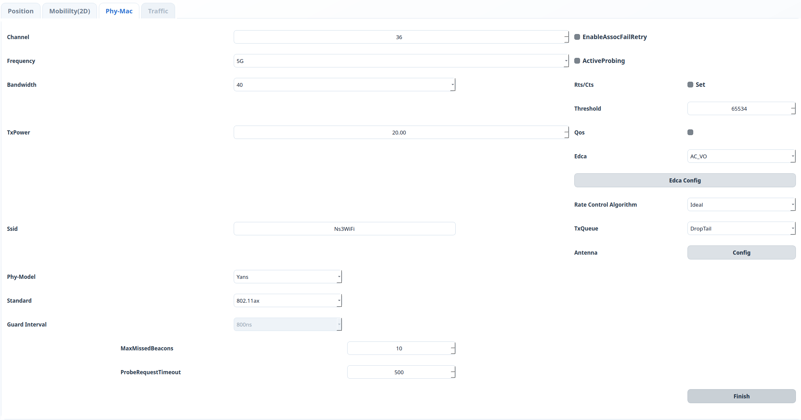

STA 页面与 AP 页面类似，但包含 STA 关联相关参数：

- active probing；
- maximum missed beacons；
- probe request timeout；
- association retry。

同时也支持移动模型、PHY/MAC、RTS/CTS、速率控制、QoS/EDCA、聚合、天线和 STA 发起的业务流配置。

### 7. EDCA/QoS 对话框

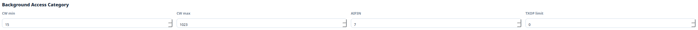

EDCA 对话框用于配置不同接入类别的竞争参数：

- `AC_VO`、`AC_VI`、`AC_BE`、`AC_BK`；
- CWmin；
- CWmax；
- AIFSN；
- TXOP limit。

当 AP 或 STA 启用 QoS 时，这些值会应用到对应 MAC 配置中。

### 8. 天线配置对话框

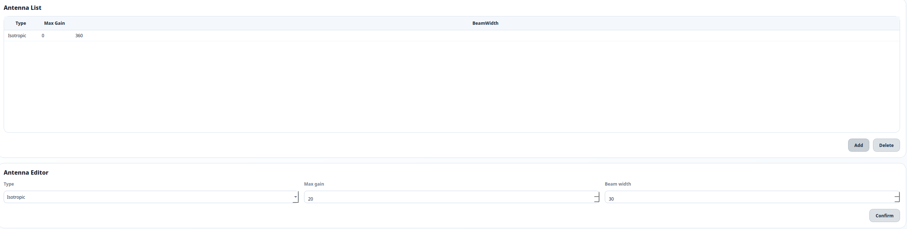

天线对话框用于配置节点天线模型，包括天线类型以及相关增益、波束宽度等参数。

### 9. 节点业务流侧栏

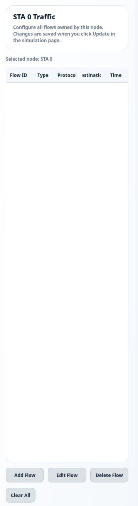

配置页右侧栏显示当前节点的业务流。选择或右键地图中的 AP/STA 后，可以查看该节点拥有的 flow。支持：

- 新增 flow；
- 编辑选中的 flow；
- 删除选中的 flow；
- 清空该节点所有 flow；
- 从已有 AP/STA 目标中选择目的节点。

更新配置后，这些 flow 会同步到 JSON 数据模型中。

### 10. Flow 配置对话框

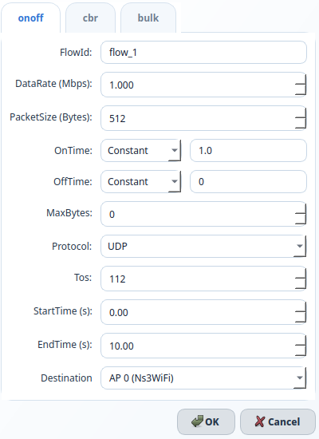

Flow 对话框支持多种业务模型：

- `OnOff`：协议、目的节点、开始/结束时间、ToS、data rate、packet size、on-time 随机变量、off-time 随机变量、max bytes；
- `CBR`：协议、目的节点、开始/结束时间、ToS、packet size、interval、max packets；
- `Bulk`：协议、目的节点、开始/结束时间、ToS、max bytes。

随机变量控件支持常量、均匀、指数等可参数化分布，具体以界面可选项为准。

## 结果可视化说明


结果页通过共享内存接收 ns-3 记录，并实时或在仿真结束后更新多个联动视图。

### PPDU Timeline


PPDU 时间线把每个 PPDU 绘制为横向时间条，宽度表示持续时间。视图支持：

- 鼠标滚轮缩放；
- 水平浏览；
- 时间范围选择；
- 导出图片；
- 图例显示；
- hover tooltip；
- 点击 PPDU 后在右侧栏查看详细信息。

### Channel-State Timeline

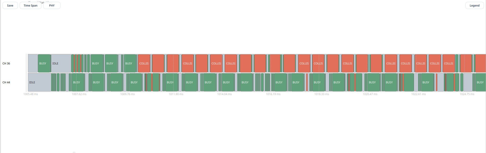

信道状态视图根据 PPDU 开始和结束时间重建信道占用，并把区间分类为 IDLE、BUSY 或 COLLISION。它适合快速定位碰撞密集区间和空闲区间。

### PHY-State Timeline

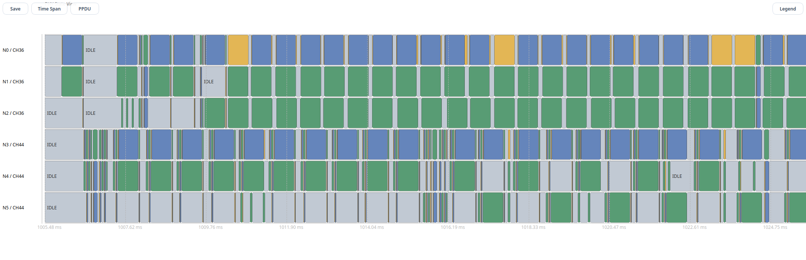

PHY 状态视图显示 IDLE、TX、RX、CCA_BUSY、SWITCHING、SLEEP、OFF 等状态转换，用于解释帧为什么被延迟、阻塞或与其他活动重叠。

### PPDU 详情侧栏

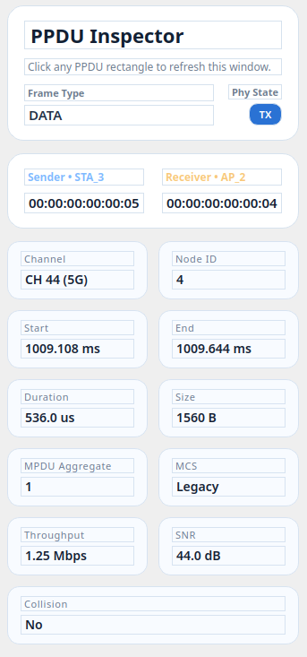

点击 PPDU 后，右侧详情栏会显示时间范围、发送端、接收端、帧类型、MCS、信道、SNR、聚合信息、排队时延、MAC 端到端时延和接收结果等字段。

### Throughput Chart

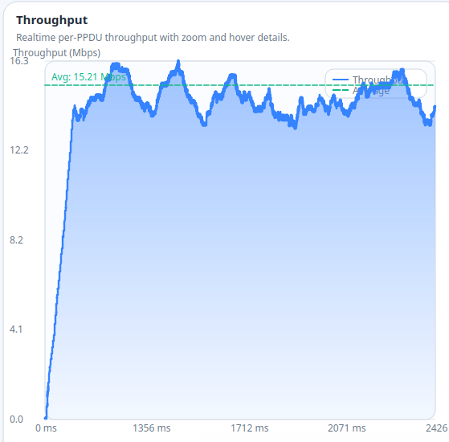

吞吐量图展示由成功接收 PPDU 数据计算出的 Mbps 吞吐采样，并绘制平均吞吐趋势线。

### Delay Charts

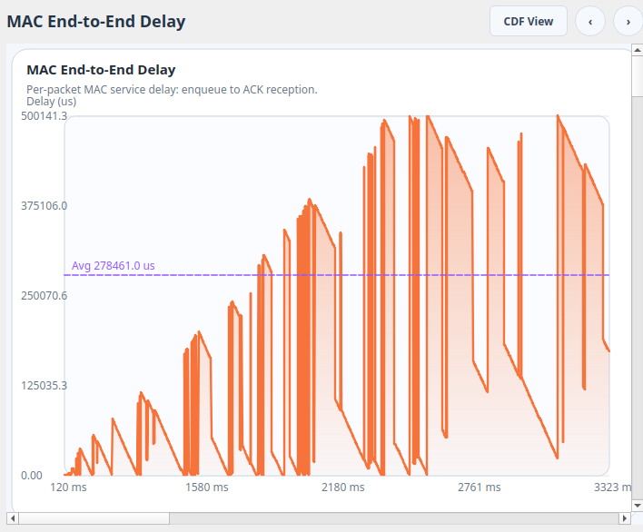

时延面板可以切换：

- `Queueing Delay`：进入 MAC 队列后等待服务的时间；
- `MAC End-to-End Delay`：从入队到 MAC 层成功完成/确认的时间。

这些图适合分析 MAC 拥塞、竞争等待和服务时间变化。

### Frame Mix Chart

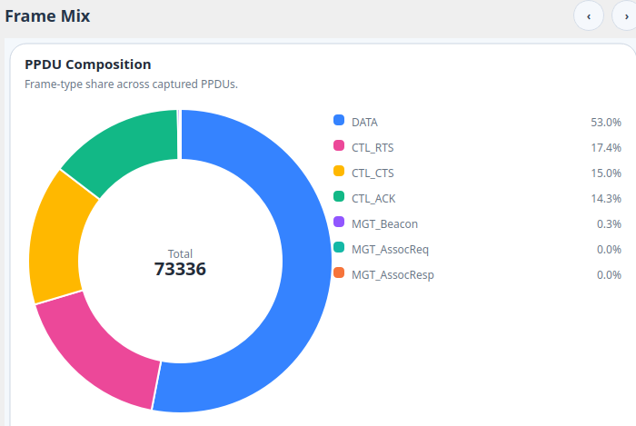

帧组成图统计 data、control、management 和其他帧类型比例，用于检查协议开销和 RTS/CTS、ACK、管理帧行为。

### Node Throughput Chart

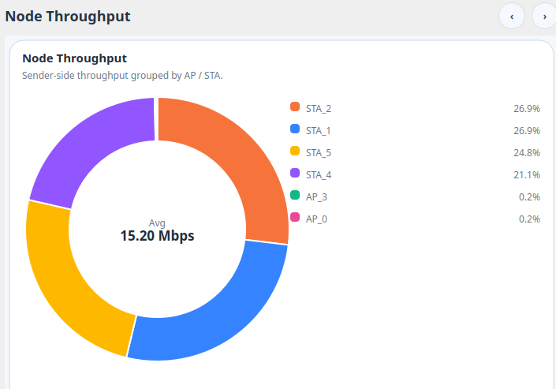

节点吞吐图按 AP/STA MAC 地址聚合吞吐贡献，展示节点级别的吞吐占比，用于判断公平性、业务集中和拓扑不对称影响。

### RX Outcome Chart

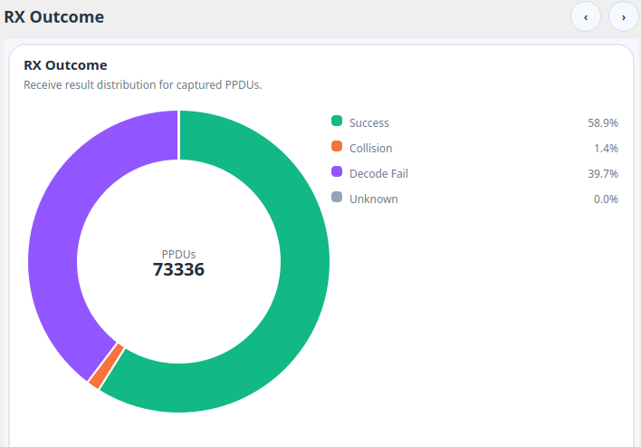

接收结果图把接收结果分为成功、碰撞相关失败和其他解码失败。该图应结合 PPDU 时间线和信道状态时间线一起分析。

### MCS Distribution Chart

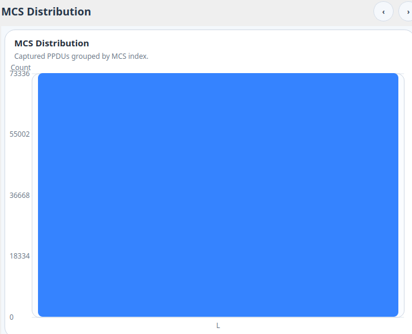

MCS 分布图统计不同调制编码方案的使用频率，用于观察速率自适应行为和链路质量。

### Output 窗口

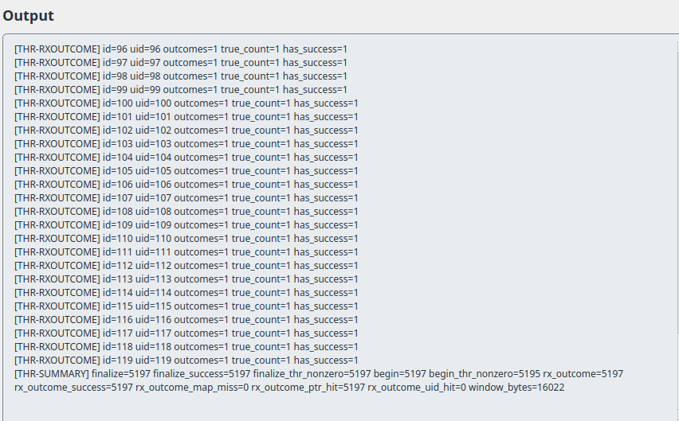

`Output` 按钮会打开只读的工业灰色输出窗口，显示 `./ns3 build`、`./ns3 run`、脚本生成器、stdout 和 stderr 日志。

## 项目和数据文件

全量 GUI 模式会把项目数据写到：

```text
contrib/Ns3Visualizer/Simulation/Designed/Designed_<timestamp>/
├── GeneralJson/
│   └── General.json
├── ApConfigJson/
│   └── Ap_<id>.json
└── StaConfigJson/
    └── Sta_<id>.json
```

生成的 ns-3 C++ 脚本会写到：

```text
scratch/<generated-target>.cc
```

这些文件属于运行时生成文件，不应该提交到本仓库。

## 模块目录说明

```text
contrib/Ns3Visualizer/
├── CMakeLists.txt
├── model/
│   ├── QNs3.*                 # JSON 配置结构和解析
│   └── SniffUtils.*           # ns-3 trace 收集和共享内存写入
├── helper/
│   └── QNs3-helper.*          # Wi-Fi 配置和可视化启动 helper
├── examples/                  # 使用 helper 的 ns-3 示例
├── test/                      # ns-3 测试骨架
├── Simulation/Default/        # GUI 内置简单/复杂场景
├── doc/                       # ns-3 模块文档
├── utils/doc/                 # 补充说明
└── ui/
    ├── main.cpp               # GUI 入口和 timeline-only 模式
    ├── mainwindow.*           # 页面导航和信号连接
    ├── simu_config.*          # building/layout/generate/build/run
    ├── ap_config.*            # AP 参数界面
    ├── node_config.*          # STA 参数界面
    ├── flow_dialog.*          # 业务流编辑器
    ├── node_traffic_panel.*   # 右侧栏节点业务流编辑器
    ├── ppdu_timeline_view.*   # PPDU/信道/PHY 时间线
    ├── *_chart.*              # 吞吐、时延、RX、MCS 和统计图
    ├── process_terminal.*     # 输出窗口
    └── utils/
        └── ns3-script-generator.cc
tools/
└── visualizer.cc              # 用于 `./ns3 run visualizer` 的 scratch 启动器
```

## 图片和 GIF 清单

准备公开 README 时，把以下图片放到 `img/` 目录：

| 文件 | 内容 |
| --- | --- |
| `img/overview.gif` | 从选择、配置、运行到查看结果的整体流程。 |
| `img/full-gui-workflow.gif` | 全量 GUI 从配置到结果页的完整操作。 |
| `img/welcome-ns3-path.png` | 欢迎页和 ns-3 路径选择。 |
| `img/scene-library.png` | Simple/Complex/Scratch 场景库、预览图和 Markdown 说明。 |
| `img/simulation-config-overview.png` | 完整仿真配置页。 |
| `img/building-config.png` | Building 和全局仿真参数区域。 |
| `img/layout-map.gif` | 拖动 AP/STA 节点和使用放大地图。 |
| `img/ap-config.png` | AP 配置页。 |
| `img/sta-config.png` | STA 配置页。 |
| `img/edca-config.png` | EDCA/QoS 对话框。 |
| `img/antenna-config.png` | 天线配置对话框。 |
| `img/node-traffic-panel.png` | 选中节点后的右侧 flow 面板。 |
| `img/flow-dialog.png` | OnOff/CBR/Bulk flow 配置对话框。 |
| `img/generate-build-run.gif` | 点击 Generate 后生成、构建、运行并进入结果页。 |
| `img/visualization-dashboard.png` | 结果可视化总览。 |
| `img/ppdu-timeline.gif` | PPDU 时间线缩放、hover 和选择。 |
| `img/channel-state-timeline.png` | 信道 IDLE/BUSY/COLLISION 视图。 |
| `img/phy-state-timeline.png` | PHY 状态时间线。 |
| `img/ppdu-detail-sidebar.png` | PPDU 详情侧栏。 |
| `img/throughput-chart.png` | 吞吐图和平均线。 |
| `img/delay-charts.png` | Queueing Delay 和 MAC End-to-End Delay。 |
| `img/frame-mix-chart.png` | 帧组成统计图。 |
| `img/node-throughput-chart.png` | 节点吞吐占比图。 |
| `img/rx-outcome-chart.png` | 接收结果图。 |
| `img/mcs-distribution-chart.png` | MCS 分布图。 |
| `img/output-window.png` | 只读 Output 窗口。 |

## 常见问题

### 找不到 `build/Ns3VisualizerApp`

重新构建：

```bash
cd /path/to/ns-3.46
./ns3 configure
./ns3 build
```

同时检查 Qt 开发包是否安装。

### 找不到 `build/ns3-script-generator`

脚本生成器会随 Qt 前端一起构建。重新执行 `./ns3 build`，并检查 CMake 输出中是否有 Qt 或编译器错误。

### 全量 GUI 生成了脚本，但是结果页没有数据

查看 Output 窗口。常见原因包括：

- simulation time 为 0；
- 没有 AP 或没有 STA；
- 没有在仿真时间内启动的业务流；
- 生成脚本构建失败；
- 脚本没有通过 `--enable-visualizer=1` 或脚本内默认 `enableVisualizer = true` 启用可视化记录。

### 一键模式运行了，但没有弹出 viewer

检查：

- `build/Ns3VisualizerApp` 是否存在；
- 脚本是否调用 `QNs3Helper::MaybeEnableVisualizer(..., true)`；
- 环境变量 `NS3_VISUALIZER_DISABLE_VIEWER` 是否被设置为 `1`；
- 是否在 ns-3 根目录执行命令。

### 大规模仿真卡顿

使用采样模式：

```bash
./ns3 run "your-script --enable-visualizer=1 --precise=0 --rough=10"
```

增大 `rough` 可以减少可视化采样数量。

## 对开发者的建议

- 源码变更应保持在 `contrib/Ns3Visualizer` 内；
- 保持 `tools/visualizer.cc` 与全量 GUI 启动方式一致，因为用户会把它复制到 `scratch/visualizer.cc`；
- 不要提交 `Simulation/Designed/`；
- 不要提交生成的 scratch 脚本；
- 不要提交打包产物或 AppImage 解压目录；
- 仓库应保持为独立 contrib 工具，不包含完整 ns-3 源码。

## License

本项目遵循 ns-3 contrib 模块风格。具体许可请参考源码文件和 ns-3 许可条款。
