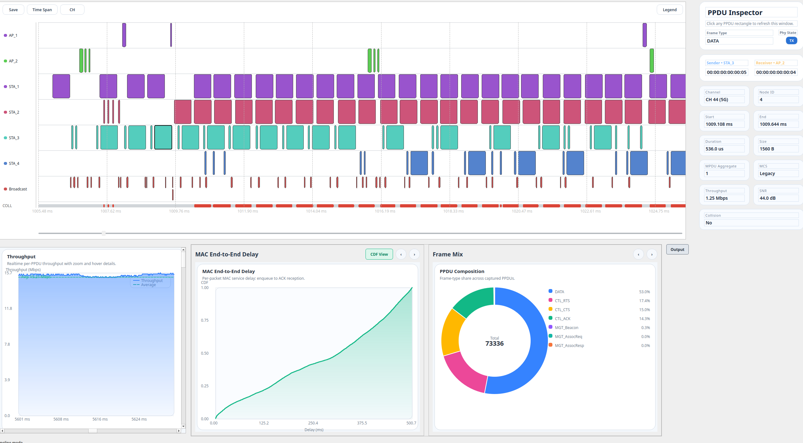
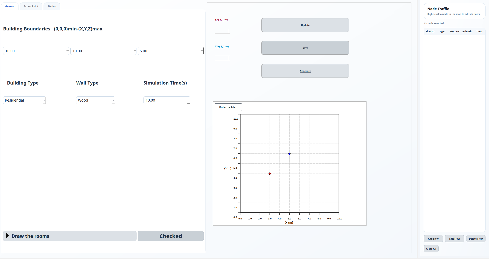
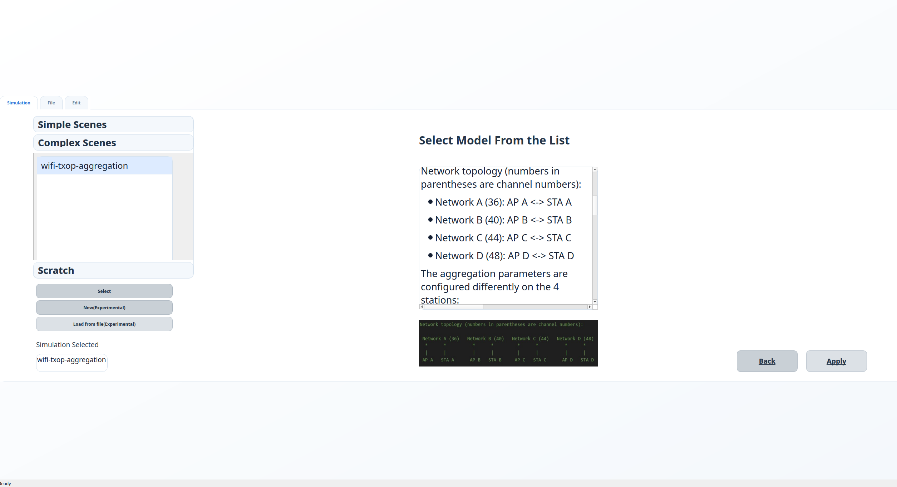

[En](README.md) | [中文](README.zh-CN.md)

# WiFiViz

`WiFiViz` 是一个 ns-3 contrib 模块，用于通过 Qt 图形界面创建、运行和分析 Wi-Fi 仿真。它把场景配置、JSON 持久化、脚本生成、ns-3 执行、共享内存轨迹采集，以及 PHY/MAC 交互式可视化整合在一个工具中。

本仓库是独立的 `wifiviz` contrib 模块。工具名称为 `ns3-WiFiViz`，Qt 应用仍为 `WiFiVizApp`，模块目录和 CMake 模块名均为小写 `wifiviz`。



## 目录

- [包结构](#包结构)
- [主要功能](#主要功能)
- [环境要求](#环境要求)
- [安装](#安装)
- [构建](#构建)
- [运行方式一：简单脚本模式](#运行方式一简单脚本模式)
- [运行方式二：参数脚本模式](#运行方式二参数脚本模式)
- [运行方式三：完整 GUI 模式](#运行方式三完整-gui-模式)
- [界面说明](#界面说明)
- [可视化说明](#可视化说明)
- [项目与数据文件](#项目与数据文件)
- [模块结构](#模块结构)
- [故障排查](#故障排查)
- [许可证](#许可证)

## 包结构

克隆仓库后，主要路径如下：

```text
wifiviz/
├── CMakeLists.txt
├── README.md
├── README.zh-CN.md
├── doc/
├── examples/
├── helper/
├── model/
├── test/
├── ui/
└── Simulation/
```

请将本仓库安装为 `/path/to/ns-3/contrib/wifiviz`。完整 GUI 启动器会注册为模块示例 `wifiviz-visualizer`。

## 主要功能

- 通过图形界面配置 Wi-Fi 仿真，包括建筑、AP/STA 位置、PHY/MAC 参数、移动性、天线、EDCA/QoS、聚合、RTS/CTS、Beacon 行为和业务流。
- 使用 JSON 保存场景。GUI 会在生成 ns-3 脚本前写入 `General.json`、AP JSON 和 STA JSON。
- 自动在 ns-3 `scratch/` 下生成独立 C++ 脚本。
- 完整 GUI 工作流：生成、构建、运行并可视化仿真。
- 支持已有 ns-3 脚本的简单接入方式。
- 通过共享内存把 ns-3 轨迹传输到 Qt 应用。
- 支持 PPDU 时间线、信道状态、PHY 状态、详情面板、吞吐量、时延、帧组成、节点吞吐量、接收结果、MCS 分布、PHY 状态饼图、时延 CDF 和输出窗口。



## 环境要求

WiFiViz 已按 ns-3.48 contrib 模块适配和测试，主要面向 Linux。仓库必须放在 ns-3 源码树中的 `contrib/wifiviz` 路径下，部分 GUI 路径和辅助启动命令会使用该模块路径。

构建环境要求：

- Linux 图形桌面环境，用于运行 Qt 查看器。X11 和 Wayland 均可。无头服务器或 SSH 场景建议使用脚本模式并设置 `launchViewer=false`，或配置显示转发。
- ns-3.48 源码树，并使用 CMake 配置。
- CMake 3.16 或更新版本。Qt 前端使用 CMake AUTOMOC、AUTOUIC 和 AUTORCC。
- 与 ns-3 C++ 标准匹配的编译器。
- 支持 C++17 的编译器，用于 Qt 前端和 `wifiviz-script-generator`。

所需 ns-3 模块：

- `core`、`network`、`internet`、`mobility`、`wifi`、`applications`、`buildings`、`csma`、`point-to-point` 和 `aodv`。

所需第三方库和工具：

- Qt Core、Gui 和 Widgets 开发包。优先使用 Qt 6；CMake 文件也支持 Qt 5.15。
- Boost 1.71 或更新版本头文件，尤其是 Boost Interprocess，用于 ns-3 与 Qt 查看器之间的共享内存传输。
- nlohmann JSON 头文件和 CMake 包。模块解析器包含 `nlohmann/json.hpp`，脚本生成器需要 `nlohmann_json >= 3.2.0`。
- 标准 ns-3 构建工具，例如 `git`、`python3`、`pkg-config`、CMake，以及 Ninja 或 Make。

Ubuntu 22.04/24.04 上常用的 Qt 6 依赖：

```bash
sudo apt update
sudo apt install -y \
  build-essential git python3 pkg-config cmake ninja-build \
  qt6-base-dev qt6-base-dev-tools \
  libboost-all-dev nlohmann-json3-dev
```

如果发行版只提供 Qt 5.15：

```bash
sudo apt install -y \
  build-essential git python3 pkg-config cmake ninja-build \
  qtbase5-dev qtbase5-dev-tools \
  libboost-all-dev nlohmann-json3-dev
```

## 安装

将仓库直接克隆到 ns-3 的 `contrib/` 目录中。目录名必须为 `wifiviz`：

```bash
cd /path/to/ns-3/contrib
git clone --depth 1 https://github.com/z14212638-eng/WiFiViz.git wifiviz
```

最终路径应为：

```text
/path/to/ns-3/contrib/wifiviz
```

完整 GUI 启动器注册为模块示例 `wifiviz-visualizer`，可通过 `./ns3 run wifiviz-visualizer` 启动。

## 构建

从 ns-3 根目录配置并构建。需要启用 examples，以构建 `wifiviz-visualizer` 启动目标：

```bash
cd /path/to/ns-3
./ns3 configure --enable-examples
./ns3 build
```

构建完成后应生成：

```text
build/WiFiVizApp
build/wifiviz-script-generator
```

`WiFiVizApp` 是 Qt 前端，`wifiviz-script-generator` 用于把 JSON 场景文件转换为独立 ns-3 C++ 脚本。

## 运行方式一：简单脚本模式

简单模式适合大多数用户。你可以按普通 ns-3 方式编写脚本，然后在脚本末尾附近加入一小段 WiFiViz 代码。所有 WiFiViz 选项都直接写为函数参数，不需要额外命令行解析。

先包含聚合头文件：

```cpp
#include "ns3/wifiviz.h"
```

创建 AP 和 STA 的 `NetDeviceContainer` 后，合并需要跟踪的设备：

```cpp
using namespace ns3;

NetDeviceContainer apDevices = ...;
NetDeviceContainer staDevices = ...;

NetDeviceContainer allDevices = WiFiVizHelper::MergeDevices(apDevices, staDevices);
```

然后调用 `MaybeEnableVisualizer`：

```cpp
bool enableViz = true;
double simulationTimeSeconds = 10.0;
bool launchViewer = true;

Ptr<SniffUtils> sniffer =
    WiFiVizHelper::MaybeEnableVisualizer(enableViz,
                                         allDevices,
                                         simulationTimeSeconds,
                                         launchViewer);
```

如果大规模仿真需要采样显示，可在调用前配置采样：

```cpp
bool precise = false;
uint32_t rough = 10;
WiFiVizHelper::ConfigureVisualizerSampling(precise, rough);
```

正常运行脚本即可：

```bash
cd /path/to/ns-3
./ns3 run your-target
```

## 运行方式二：参数脚本模式

参数模式适合需要从终端切换是否启用 WiFiViz 的脚本。脚本定义命令行参数后，把解析结果传给同一组 helper 函数。

```cpp
#include "ns3/wifiviz.h"

bool enableWiFiViz = false;
bool launchViewer = true;
bool precise = true;
uint32_t rough = 1;
double simulationTimeSeconds = 10.0;

CommandLine cmd(__FILE__);
cmd.AddValue("enable-wifiviz", "Enable WiFiViz timeline capture", enableWiFiViz);
cmd.AddValue("launch-viewer", "Launch the WiFiViz timeline viewer", launchViewer);
cmd.AddValue("precise", "Use precise PPDU visualization", precise);
cmd.AddValue("rough", "Sample one PPDU out of rough records when precise=false", rough);
cmd.AddValue("simulation-time", "Simulation duration in seconds", simulationTimeSeconds);
cmd.Parse(argc, argv);
```

创建设备后：

```cpp
NetDeviceContainer allDevices = WiFiVizHelper::MergeDevices(apDevices, staDevices);

WiFiVizHelper::ConfigureVisualizerSampling(precise, rough);

Ptr<SniffUtils> sniffer =
    WiFiVizHelper::MaybeEnableVisualizer(enableWiFiViz,
                                         allDevices,
                                         simulationTimeSeconds,
                                         launchViewer);
```

运行示例：

```bash
cd /path/to/ns-3
./ns3 run "your-target --enable-wifiviz=1 --launch-viewer=1 --precise=1 --rough=1 --simulation-time=10"
```

采样模式示例：

```bash
./ns3 run "your-target --enable-wifiviz=1 --launch-viewer=1 --precise=0 --rough=10 --simulation-time=10"
```

## 运行方式三：完整 GUI 模式

完整模式先启动 WiFiViz GUI，由 GUI 根据配置页面生成 scratch 脚本。它适合快速尝试图形化配置流程。

通过 ns-3 启动 GUI：

```bash
cd /path/to/ns-3
./ns3 run wifiviz-visualizer
```

`wifiviz-visualizer` 来自 `examples/wifiviz-visualizer.cc`，只负责从 ns-3 根目录启动 `build/WiFiVizApp`，不会修改 ns-3 内部文件。也可以直接运行：

```bash
./build/WiFiVizApp
```

完整模式流程：

1. 在欢迎页选择 ns-3 目录。
2. 在 GUI 中配置简单 Wi-Fi 场景。
3. 点击 `Generate`。
4. GUI 写入 JSON 文件，运行 `build/wifiviz-script-generator`，创建 `scratch/*.cc` 脚本，执行 `./ns3 build`，然后以启用 WiFiViz 的方式运行生成目标。

当前限制：完整模式脚本生成器目前主要生成简单脚本。复杂实验、自定义 helper、高级业务模式或非标准 ns-3 工作流可能需要手写脚本。可参考 `examples/wifiviz-basic-example.cc`，然后使用简单脚本模式可视化结果。

## 界面说明

### 欢迎页和 NS-3 路径页


欢迎页用于选择 ns-3 根目录。进入仿真流程前会验证该目录，工具栏也提供 `NS-3 Path` 操作用于后续切换工作目录。

### 场景库页



场景页提供三个入口：

- `Simple`：内置简单示例，位于 `contrib/wifiviz/Simulation/Default/Simple`。
- `Complex`：内置复杂示例，位于 `contrib/wifiviz/Simulation/Default/Complex`。
- `Scratch`：ns-3 `scratch/` 下可读取的 `*.cc` 文件。

选择场景后可以预览说明，运行可视化路径，进入配置页面，或加载保存的项目 JSON。

### 仿真配置页


配置页用于创建新场景，包括全局建筑设置、AP/STA 创建、节点表格、交互式布局画布、校验/更新控件和最终 `Generate` 操作。

### AP/STA 配置页

AP 页面配置接入点位置、移动性、Wi-Fi 标准、信道、频率、带宽、保护间隔、PHY 模型、发射功率、接收灵敏度、SSID、Beacon、RTS/CTS、速率控制、队列、QoS/EDCA、聚合、天线和业务流。

STA 页面包含类似配置，并增加主动探测、最大丢失 Beacon、探测请求超时和关联重试等站点相关选项。

### 业务流配置

节点右侧面板和业务流对话框支持为 AP/STA 添加、编辑和删除业务流。当前支持 `OnOff`、`CBR` 和 `Bulk` 类型，并可配置协议、目标、起止时间、ToS、数据率、包大小、随机变量和字节/包数限制。

## 可视化说明

结果面板通过共享内存接收 ns-3 记录，并在仿真期间或仿真结束后更新视图。

- PPDU 时间线显示每个 PPDU 的起止时间、发送方、信道和相关元数据。
- 信道状态视图重建 IDLE、BUSY 和 COLLISION 区间。
- PHY 状态视图显示 IDLE、TX、RX、CCA_BUSY、SWITCHING、SLEEP 和 OFF 等状态转换。
- 详情侧栏展示选中 PPDU 的时间、发送方、接收方、帧类型、MCS、信道、SNR、聚合信息、排队时延、MAC 端到端时延和接收结果。
- 统计图包括吞吐量、时延、帧组成、节点吞吐量、RX 结果、MCS 分布、PHY 状态占比和时延 CDF。
- `Output` 窗口显示 `./ns3 build`、`./ns3 run`、脚本生成器、stdout 和 stderr 日志。

## 项目与数据文件

完整 GUI 模式会在以下目录写入项目数据：

```text
contrib/wifiviz/Simulation/Designed/Designed_<timestamp>/
├── GeneralJson/
│   └── General.json
├── ApConfigJson/
│   └── Ap_<id>.json
└── StaConfigJson/
    └── Sta_<id>.json
```

生成的 ns-3 C++ 脚本写入：

```text
scratch/<generated-target>.cc
```

## 模块结构

```text
contrib/wifiviz/
├── CMakeLists.txt
├── model/
│   ├── wifiviz.h              # 用户脚本公共聚合头文件
│   ├── QNs3.*                 # JSON 配置结构和解析辅助
│   └── SniffUtils.*           # ns-3 轨迹采集和共享内存写入
├── helper/
│   └── QNs3-helper.*          # WiFiVizHelper 实现
├── examples/                  # 用户脚本模板
├── test/                      # ns-3 单元测试
├── Simulation/Default/        # 内置 GUI 示例场景
├── doc/                       # ns-3 模块文档
└── ui/                        # Qt 前端和脚本生成器
```

## 故障排查

### `build/WiFiVizApp` 不存在

```bash
cd /path/to/ns-3
./ns3 configure
./ns3 build
```

同时检查 Qt 开发包是否已安装。

### `build/wifiviz-script-generator` 不存在

脚本生成器会和 Qt 前端一起构建。重新运行 `./ns3 build`，并检查 CMake 输出中的 Qt 或编译器错误。

### 完整 GUI 模式生成了脚本但没有包显示

常见原因包括仿真时间为 0、没有配置 AP 或 STA、业务流未在仿真期间启动、生成脚本构建失败，或脚本侧未启用 WiFiViz。

### 脚本模式运行但查看器没有出现

请确认：

- `build/WiFiVizApp` 存在。
- 脚本调用了 `WiFiVizHelper::MaybeEnableVisualizer(..., true)`。
- 环境变量 `WIFIVIZ_DISABLE_VIEWER` 没有设置为 `1`。
- 当前命令从 ns-3 根目录运行。

### 大规模仿真较慢

使用采样可视化：

```bash
./ns3 run "your-target --enable-wifiviz=1 --precise=0 --rough=10"
```

增大 `rough` 可以减少显示的 PPDU 样本数量。

## 许可证

除特别说明外，本项目使用 MIT License。部分来自 ns-3 的示例文件保留原有 GPL-2.0-only SPDX 头。该许可证组合与 ns-3 app-store 贡献要求兼容。
